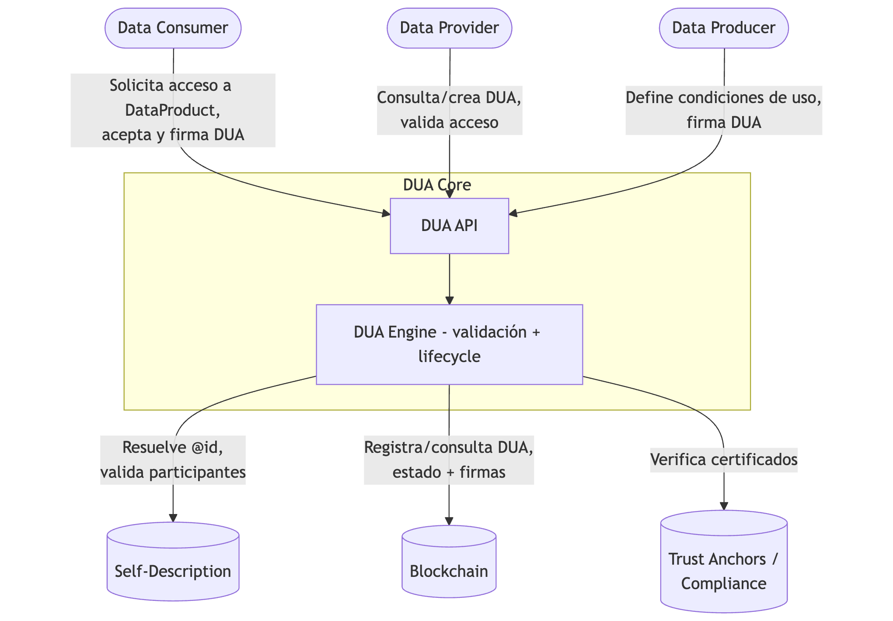
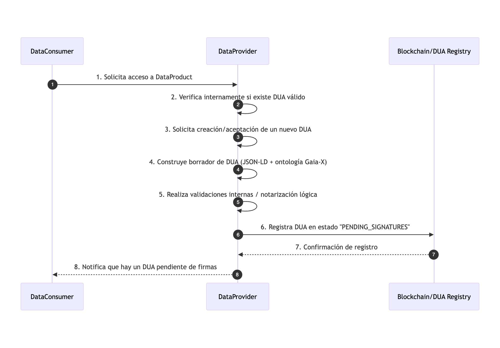
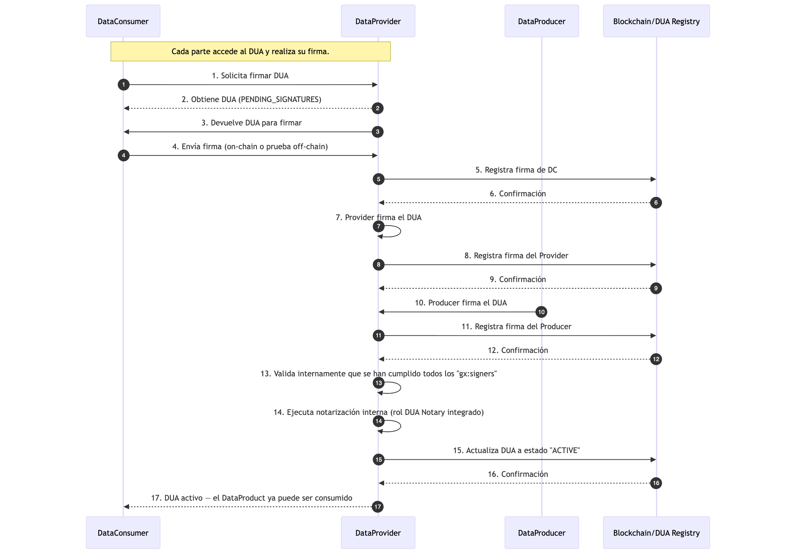
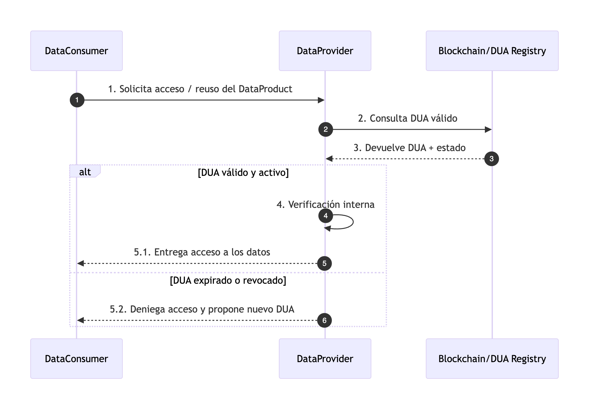

# Arquitectura DUA

## Visión general

Un Data Usage Agreement (DUA) es un acuerdo formal entre:

- el titular de los derechos de los datos (Data Producer)
- el proveedor de los datos (Data Provider)
- el consumidor de los datos (Data Consumer)

que define bajo qué condiciones esos datos pueden ser usados

## Actores

### 1. Data Producer

Es quien tiene los derechs sobre los datos (propiedad intelectual, licencia, etc). Decide si sus datos pueden usarse, su proposito, bajo que condiciones. Es uno de los firmantes del DUA como dueño del datos.
Por lo tanto, deberé de existis en **self-description** y, por lo tanto, es un participante en la creación y firma DUA.

[Modelo GAIA-X data producer](https://gaia-x.gitlab.io/technical-committee/service-characteristics-working-group/service-characteristics/classes/DataProducer/)

### 2. Data Provider

Es quien expone el Data Product y gestiona el acceso al dato.
Su responsabilidad es comprobar,siempre que se quiere acceder al Data Product:

- Existe un DUA valido
- Dua este vigente cuando se usen los datos
- Cumplan las condiciones

Por lo tanto, este deberá de existir en **self-description** y ofrece el servicio de verificacion DUA

[Modelo GAIA-X data provider](https://gaia-x.gitlab.io/technical-committee/service-characteristics-working-group/service-characteristics/classes/DataProvider/)

### 3. Data Consumer

Es quien quiere usar los datos ofrecidos por Data Provider, Este usaurio debe solicitar acceso al Data Product, aceptando DUA y cumplir la condiciones.

Por lo tanto, este deberá de existir en **self-description**, firmar el DUA para poder acceder al dato

[Modelo GAIA-X data consumer](https://gaia-x.gitlab.io/technical-committee/service-characteristics-working-group/service-characteristics/classes/DataConsumer/)

### 4. Notary

Según la info GAIA-X es un servicio que valida y se asegura que existe un DUA vinculante entre el Data Producer y Data Consumer

### 5. Trust Anchor

Un Trust Anchor es una autoridad de confianza que respalda la veracidad de la información declarada por un participante en GAIA-X

### 6. Self Description

Registro donde se almacena la informacion

- Participantes (Data Consumner, Data Producer,...)
- Listas DUA generados
- Info necesario

Por lo tant, este componente quien almacenas de forma "local" quien es quien, DUA creados, en resumen donde se almancena la informacion.

## Contexto sistema DUA

Conexiones clave entre actores y el sistema

- Data Consumer ↔ DUA Core

  - Inicia solicitudes de acceso
  - Visualiza y acepta DUA
  - Firma (directa o indirectamente) el DUA.

- Data Provider ↔ DUA Core

  - Usa el sistema para permitir/denegar acceso
  - Dispara la creación de un nuevo DUA cuando no existe
  - Consulta estados (ACTIVE/REVOKED/EXPIRED)

- Data Producer ↔ DUA Core

  - Participa en la definición de restricciones de uso y firma del DUA
  - Puede revocar DUA o pedir su revocación.

- DUA Core ↔ Blockchain

  - Persistencia auditable del DUA y su ciclo de vida
  - Registro de firmas
  - Fuente de verdad para comprobaciones y auditoria posteriores

- DUA Core ↔ Self-Description
  - Garantiza que quien firma hace referencia a entidades reales y válidas
- DUA Core ↔ Trust Anchors
  - Añade la capa de confianza criptográfica/legal (certificados, credenciales verificables, ...)

## Casos de uso

### 1. Solicitud de acceso dato - Primera vez

Data Consumer pide acceso a un Data Product, mediante un Data Provider, si aún no existe un DUA válido entre las partes, el sistema debe generar un nuevo DUA y registrarlo

### 2. Firma del DUA

Permitir que Data Consumer, Data Provider y, opcionalmente, Data Producer firmen el DUA hasta cumplir lo definido

### 3. Reutilización de datos y validación de DUA

Cuando el Data Consumer quiere volver a usar el mismo Data Product, el Data Provider verifica si el DUA sigue vigente antes de conceder acceso

Esta lógica implementa la idea de trusted data transactions:

- No se trata solo de tener acceso a los datos, sino de comprobar si el derecho de uso sigue vigente.

- La blockchain permite realizar estas verificaciones de forma determinista y auditable

